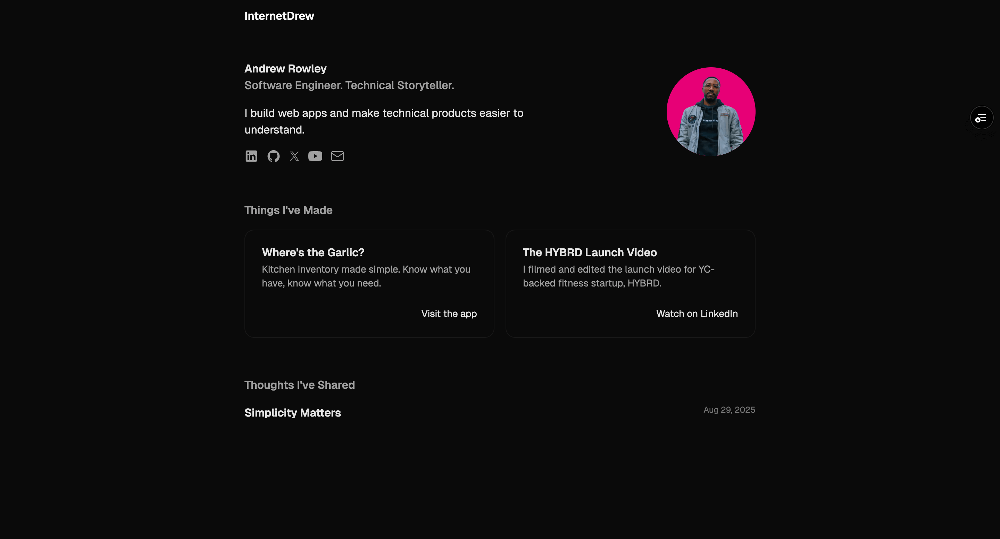
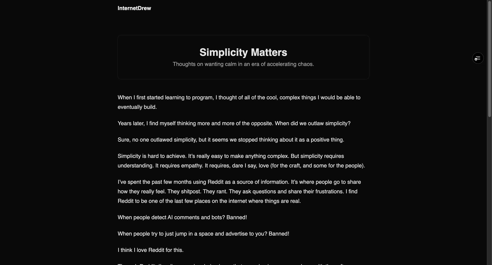

# Welcome to My Portfolio

Hi. I'm Andrew. This is my portfolio. I built this to be fast, light, and performant. I went for a very minimalistic approach here as I attempt the find the balance for my own aesthetics.

## Table of Contents

- [Screenshots](#screenshots)
- [Installation](#installation)
- [Usage](#usage)

## Screenshots




## Installation

Here's how you can get this build up and running locally.

1. Create your directory and:

```sh
git clone https://github.com/internetdrew/portfolio-v3.git .
```

2. Install dependencies:

```sh
npm i
```

3. Start the development server:

```sh
npm run dev
```

4. Open your browser to [`http://localhost:4321/`](http://localhost:4321/)

## Usage

If you would like to use this as a template to get you started, there are a few places you will want to focus on changing things:

- `/public/`
  - these assets exist for things I have created (blog posts, etc.)
- `/src/layouts/`
  - The `Head` element contains pertinent information that you will want to point to you and your site. You absolutely want to change these to point to your assets.
- `.env`
  - In `/.env.example` you will see the values you need to add to your `.env` file. Create via GUI or from the terminal using the touch command at the root of the directory:
    ```sh
    touch .env
    ```
  - To find the values you need, head on over to [EmailJS](https://www.emailjs.com/) and create a free account to get your credentials.
- `/astro.config.mjs`
  - This is currently set to be deployed via Vercel. If you plan to deploy elsewhere, you may need to change your `adapter`, a necessary piece for successful usage of the API route that handles form submission.
