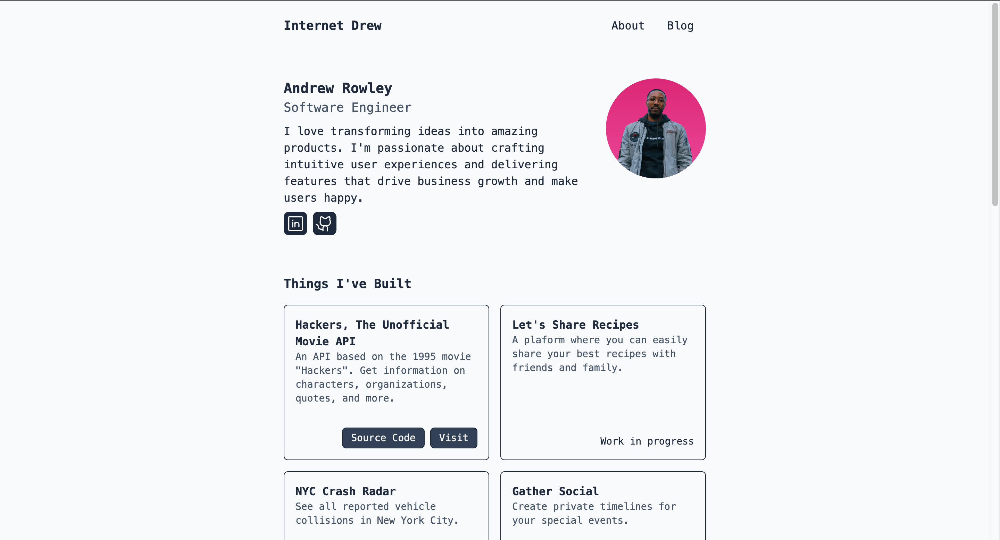
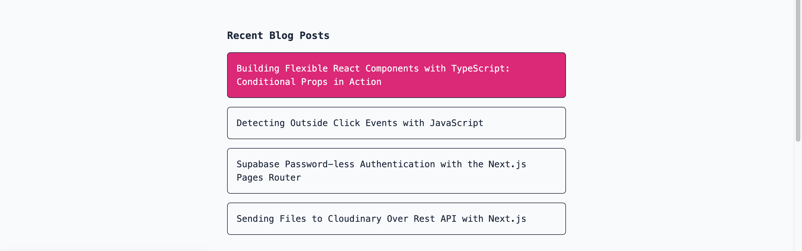
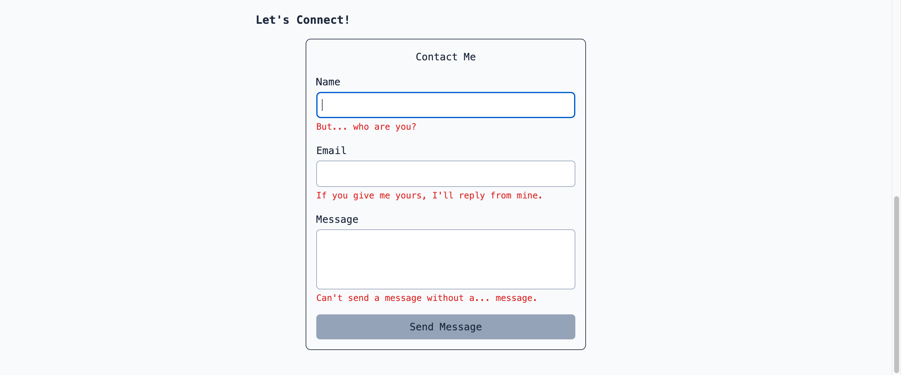

# Welcome to My Portfolio

Hi. I'm Andrew. This is my portfolio. I built this with [Astro](https://astro.build/), my favorite web framework for building fast, light, performant websites.

I went for a very minimalistic approach here.

## Screenshots





## Installation

Here's how you can get this build up and running locally.

1. Create your directory and:

```sh
git clone https://github.com/internetdrew/portfolio-v3.git .
```

2. Install dependencies:

```sh
npm i
```

3. Start the development server:

```sh
npm run dev
```

## Using This as a Template

If you would like to use this as a template to get you started, there are a few places you will want to focus on changing things:

- `/public/`
  - these assets exist for things I have created (blog posts, etc.)
- `/src/layouts/`
  - The `Head` element contains pertinent information that you will want to point to you and your site. You absolutely want to change these to point to your assets.
