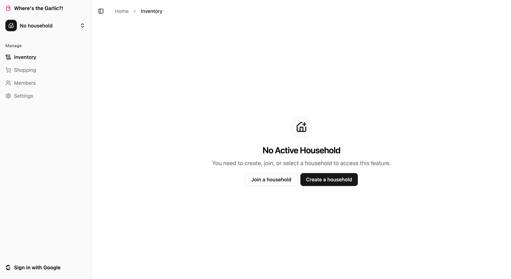
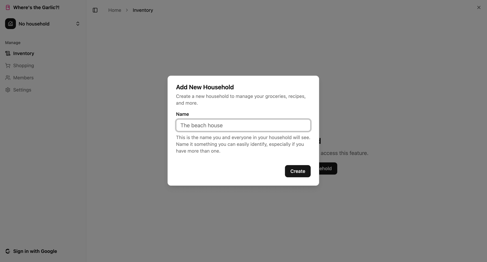
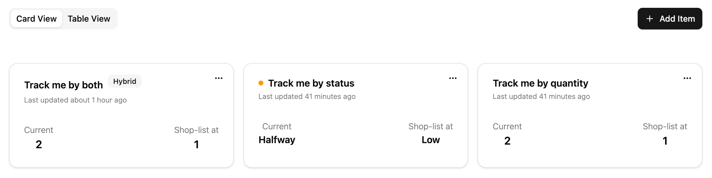
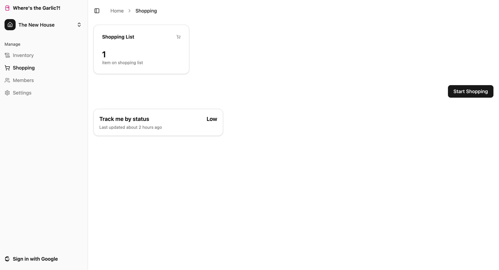
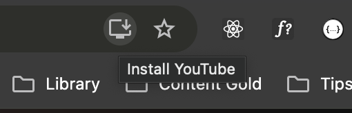
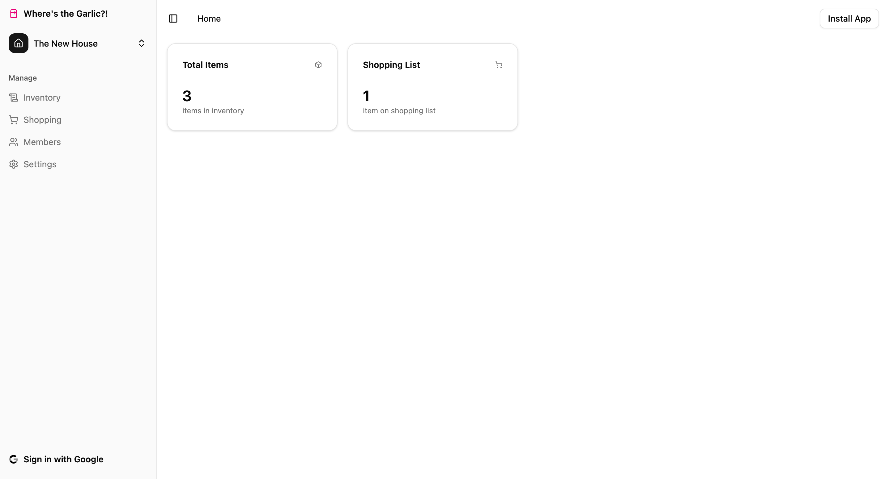
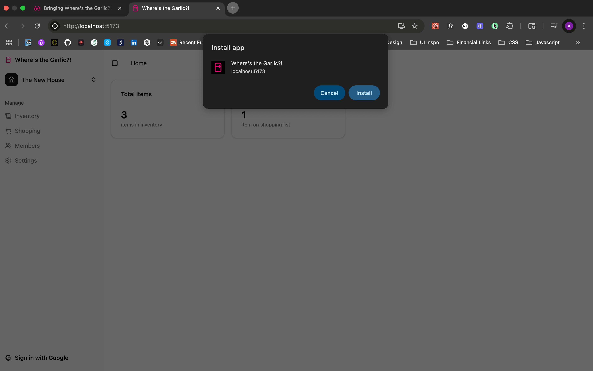
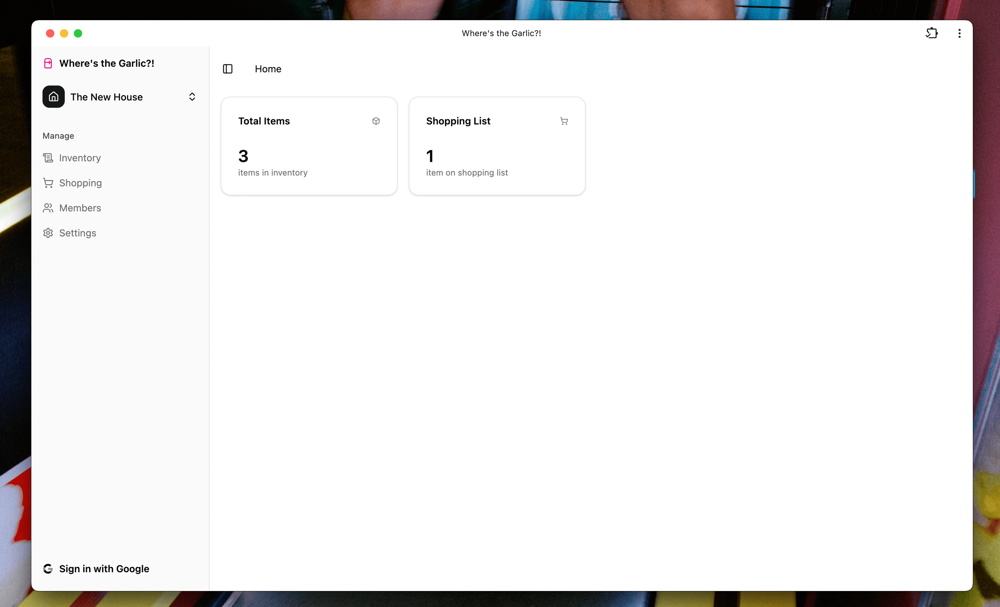
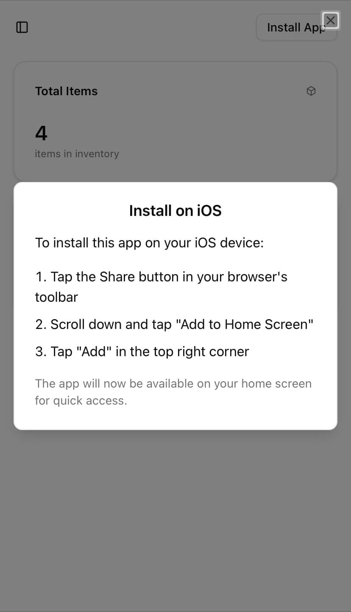

## Table of Contents

## What I'm Building and Why

I'm building [Where's the Garlic?!](https://app.wheresthegarlic.com), a home kitchen management app for organized foodies who live and cook together. I'm building this because there have been countless times when my partner and I have gotten to the supermarket and neither of us is completely sure how we are on groceries, what we're almost out of, and we have an excess of, etc.

As someone mildly organized in a relationship with someone who is wildly organized, I figured I'd have fun building an app that keeps us on the same page with ease.

## About the App

To address the problem of not knowing how we are on groceries, the app will be our home for what items we track on a regular basis and their current status.

We want to be able to do 3 things with this app to start:

1. **Keep track of items based on quantity, status, and sometimes both**. The statuses should be simple but dynamic. Some items, like bagels, are tracked by quantity. Some items, like a gallon of milk (which we typically only have one of), are tracked by status (full, halfway, almost out, done). Some items need both because we might have a few at once, so we track both how many and whether the last one is almost gone.

2. **Automatically generate a shopping list based on thresholds**. A large part of having this is that we also have a general idea of when we want to get more of an item. So the app will take in item thresholds that allow us to have automatically generated shopping lists based on the items that are being tracked. This will make it easy to go to the supermarket without needing to make a list because eggs were automatically added to the shopping list once we had 6 or less, for example.

3. **Work together to keep track of items**. The inherent challenge of building something like this is that people have to actually use it, which is difficult if you're not the one dealing with the annoyance. So I want to make this easy to use and as frictionless as possible. We'll need an invite system get others in the household involved. I'm curious to see if this takes off and we can use this when we have weeklong family vacations with 10 to 15 people.

## Tech Stack

- [Vite](https://vite.dev/guide/) for lightning-fast builds and local development
  - Paired with [TypeScript](https://www.typescriptlang.org/) for static typing and better DX
  - Uses [SWC](https://swc.rs/) for fast transpilation
- [React 19](https://react.dev/) for a modern, component-based UI architecture
- [shadcn/ui](https://ui.shadcn.com/) for accessible, pre-built components styled with [Tailwind CSS](https://tailwindcss.com/)
- [tRPC](https://trpc.io/) to enable end-to-end type-safe APIs without code duplication
- [Zod](https://zod.dev/) for runtime validation and schema inference, used with tRPC and form data
- [TanStack Query](https://tanstack.com/query/latest) to handle client-side data fetching, caching, and syncing
- [React Router](https://reactrouter.com/) for declarative client-side routing
- [Express](https://expressjs.com/) as a lightweight, flexible Node.js backend
- PostgreSQL, managed via [Supabase](https://supabase.com/) for relational data, auth, and storage
- [React Testing Library](https://testing-library.com/docs/react-testing-library/intro/) for testing UI components based on real user interactions
- [Vitest](https://vitest.dev/) for fast, Vite-native testing with first-class TypeScript support and great DX

## Building a Local-First Web App

I recently stumbled across a subreddit people were sharing that there are many products that they don't try simply because the app is behind a sign up. And they'll walk away quickly before giving up their email address to use something they're not even sure if they will like or want.

Requiring authentication upfront could turn away users who might otherwise love the app, since they hit a login wall before seeing what it does.

User experience a critical factor here because it might directly impact adoption. So, while it's surely more work up-front, I believe the right move is to make it as easy as possible for people to play with the app to see if it's what they're looking for.

I've never built an app that would do this before. Most times, I build apps behind authentication to be able save to a database or object storage. You don't just want that exposed. But in the event of a local-first web app, one that needs to be able to save and organize possibly many values (one could add very many items!), I need to write operations that save to either a local database if the user is not authenticated or the remote database if the user is authenticated.

To handle local data storage, I turned to [IndexedDB](https://developer.mozilla.org/en-US/docs/Web/API/IndexedDB_API), a lightweight database that runs right in the browser and lets users save data without needing to sign up. Even better than IndexedDB itself was discovering [Dexie](https://dexie.org/), a wrapper library that let me move faster without getting bogged down in verbose web API syntax.

Dexie allowed me to move very quickly on creating tables and indexing things I'd be using in queries:

```typescript
import Dexie, { type EntityTable } from "dexie";
import type { Tables } from "@/database.types";

type Household = Tables<"households">;
/*
type Household = {
    created_at: string;
    creator_id: string;
    id: string;
    title: string;
    updated_at: string;
}
*/

// Creates a new database named WTGarlic
// Adds a table named households with the type and id as the primary key
const dexie = new Dexie("WTGarlic") as Dexie & {
  households: EntityTable<Household, "id">;
};

// Tells Dexie which columns to index for queries
dexie.version(1).stores({
  households: "id, title, created_at, creator_id, updated_at",
});

export type { Household };
export { dexie };
```

This is the first pass at splitting logic based on auth: if the user is logged in, we send the data to the backend. If not, we save it locally with IndexedDB.

```typescript
const onSubmit = async (values: z.infer<typeof formSchema>) => {
  try {
    if (user) {
      // Use our tRPC mutation to hit the backend
      await createHouseholdMutation.mutateAsync(values);
    } else {
      // save to IndexedDB
      await dexie.households.add({
        id: crypto.randomUUID(),
        created_at: new Date().toISOString(),
        creator_id: "local-user",
        title: values.name,
        updated_at: new Date().toISOString(),
      });
    }
    onSuccess();
  } catch (error) {
    console.error("Failed to save household:", error);
  }
};
```

## Creating Context on Active Households

Once the household is added, we want to be able to identify the initial household as the active one.

Just about everything in this application will be dependent on which household is active. When users change the active household, you'll want all of the app data to update to be relevant to that household.

To create this logic, I used [custom Hooks in React](https://react.dev/learn/reusing-logic-with-custom-hooks) to get the households (sure I will need them in multiple places) and [React Context](https://react.dev/learn/passing-data-deeply-with-context) to wrap the app in I can access that active household data from anywhere within the app with ease.

First, I created a household-based hook to encapsulate the logic of where to search for households. If the user is authenticated, pull from the remote database, otherwise get it locally:

```typescript
import { useUser } from "@/hooks/useUser";
import { dexie } from "@/dexie-db";
import { api } from "@/utils/trpc";
import { useQuery } from "@tanstack/react-query";
import { useLiveQuery } from "dexie-react-hooks";

export function useHouseholds() {
  const { data: user } = useUser();

  const { data: remoteHouseholds = [], isLoading: isLoadingRemote } = useQuery({
    ...api.household.list.queryOptions(),
    enabled: !!user,
  });

  const localHouseholds = useLiveQuery(() => dexie.households.toArray()) || [];
  const isLoadingLocal = !localHouseholds;

  const households = user ? remoteHouseholds : localHouseholds;
  const householdsLoading = user ? isLoadingRemote : isLoadingLocal;

  return { households, householdsLoading };
}
```

This allowed me to use the household data in various places easily.

```typescript
import { createContext, useContext, useState, useEffect } from "react";
import type { Tables } from "@/database.types";
import { useHouseholds } from "@/hooks/useHouseholds";

type Household = Tables<"households">;

interface ActiveHouseholdContextType {
  activeHousehold: Household | null;
  setActiveHousehold: (household: Household | null) => void;
}

const ActiveHouseholdContext = createContext<ActiveHouseholdContextType | null>(
  null,
);

export function ActiveHouseholdProvider({
  children,
}: {
  children: React.ReactNode;
}) {
  const [activeHousehold, setActiveHousehold] = useState<Household | null>(
    null,
  );
  const { households, householdsLoading } = useHouseholds();

  useEffect(() => {
    if (!householdsLoading && households.length > 0 && !activeHousehold) {
      setActiveHousehold(households[0]);
    }
  }, [households, householdsLoading, activeHousehold]);

  return (
    <ActiveHouseholdContext.Provider
      value={{ activeHousehold, setActiveHousehold }}
    >
      {children}
    </ActiveHouseholdContext.Provider>
  );
}

export function useActiveHousehold() {
  const context = useContext(ActiveHouseholdContext);
  if (!context) {
    throw new Error(
      "useActiveHousehold must be used within an ActiveHouseholdProvider",
    );
  }
  return context;
}
```

Then I wrap the app in the context to make the hook usable:

```tsx
{
    path: "/",
    element: (
      <QueryClientProvider client={queryClient}>
        <ActiveHouseholdProvider>
          <App />
        </ActiveHouseholdProvider>
      </QueryClientProvider>
    ),
    children: [
      {
        path: "/",
        index: true,
        element: <Home />,
      },
      {
        path: "/inventory",
        element: <Inventory />,
      },
      {
        path: "/shopping",
        element: <Shopping />,
      },
      {
        path: "/members",
        element: (
          <RequireSignin>
            <Members />
          </RequireSignin>
        ),
      },
      {
        path: "/settings",
        element: <Settings />,
      },
    ],
  },
  {
    path: "*",
    element: <NotFound />,
  },
```

So now, from anywhere within the client side of the application, I can use this hook to get access to the active household and the ability to update it:

```typescript
const { activeHousehold, setActiveHousehold } = useActiveHousehold();
```

And this is the lions share of what needed to happen.

With these changes, I now have a framework for building out new features and having them operate differently based on whether or not a user is authenticated, all while keeping types coupled, which also keeps testing easy.

## Making an Active Household a Requirement for Usage

The app is being built with the idea that you might have more than one household to manage. Maybe you have your full-time home and a vacation home you stay at for a week every summer. You likely wouldn't want to mix the groceries up for those two spaces. To make that work, everything needs to be connected to a household.

In the user interface (UI), we need a way to block interactions before there is an active household. And we need a way for users to move around a bit and get a clear signal as to what their first step should be to get started.

The entire application happens in the context of a dashboard, which is the `<App />` component you see above. When the user navigates, only the inner part of the UI is changed. Since I'm using React Router for navigation, I can use an `<Outlet />` for the child components that will render in the UI.

So when the user clicks **Settings** from the sidebar, I can render the `<Settings />` child component (and any other appropriate views) with ease.

But there's one last thing that I need to keep in mind: we need a household to operate on anything.

To add that layer of protection, I've wrapped the `<Outlet />` component to require households, which brings us to a great example of the value of the `useActiveHousehold` hook:

```tsx
import { useActiveHousehold } from "@/contexts/active-household";
import { Button } from "./ui/button";
import { HousePlusIcon } from "lucide-react";
import { useState } from "react";
import {
  Dialog,
  DialogContent,
  DialogDescription,
  DialogHeader,
  DialogTitle,
} from "./ui/dialog";
import AddHouseholdForm from "./forms/AddHouseholdForm";

interface RequireHouseholdProps {
  children: React.ReactNode;
}

export function RequireHousehold({ children }: RequireHouseholdProps) {
  // The hook created to monitor active households
  const { activeHousehold } = useActiveHousehold();
  const [showDialog, setShowDialog] = useState(false);

  if (!activeHousehold) {
    // If there's no household, we return a UI that allows users to create one
    return (
      <>
        <div className="flex h-[calc(100vh-4rem)] flex-col items-center justify-center gap-4 text-center">
          <div className="bg-muted/50 flex size-16 items-center justify-center rounded-full">
            <HousePlusIcon className="size-8" />
          </div>
          <div className="space-y-2">
            <h2 className="text-2xl font-semibold tracking-tight">
              No Active Household
            </h2>
            <p className="text-muted-foreground">
              You need to create, join, or select a household to access this
              feature.
            </p>
          </div>
          <div className="flex items-center gap-2">
            <Button
              variant="outline"
              onClick={() => console.log("join household")}
            >
              Join a household
            </Button>
            <Button onClick={() => setShowDialog(true)}>
              Create a household
            </Button>
          </div>
        </div>

        <Dialog open={showDialog} onOpenChange={setShowDialog}>
          <DialogContent className="max-w-md">
            <DialogHeader>
              <DialogTitle>Add New Household</DialogTitle>
              <DialogDescription>
                Create a new household to manage your groceries, recipes, and
                more.
              </DialogDescription>
            </DialogHeader>
            <AddHouseholdForm onSuccess={() => setShowDialog(false)} />
          </DialogContent>
        </Dialog>
      </>
    );
  }

  // Otherwise, we return whatever it is that this component is wrapped around
  return <>{children}</>;
}
```

So now, within the `<App />` component, we wrap the outlet and boom: protected!

```tsx
import { AppSidebar } from "@/components/app-sidebar";
import { Separator } from "@/components/ui/separator";
import {
  SidebarInset,
  SidebarProvider,
  SidebarTrigger,
} from "@/components/ui/sidebar";
import { Outlet } from "react-router";
import RouteBreadcrumb from "./components/RouteBreadcrumb";
import { Toaster } from "./components/ui/sonner";
import { RequireHousehold } from "./components/RequireHousehold";
import InstallButton from "./components/InstallButton";

export default function App() {
  return (
    <SidebarProvider>
      <AppSidebar />
      <SidebarInset>
        <header className="bg-background sticky top-0 z-10 flex h-16 shrink-0 items-center gap-2 transition-[width,height] ease-linear group-has-[[data-collapsible=icon]]/sidebar-wrapper:h-12">
          <div className="flex w-full items-center gap-2 px-4">
            <SidebarTrigger className="-ml-1" />
            <Separator orientation="vertical" className="mr-2 h-4" />
            <RouteBreadcrumb />
            <InstallButton className="ml-auto" />
          </div>
        </header>
        <div className="flex flex-1 flex-col gap-4 pt-0">
          <RequireHousehold>
            <Outlet />
          </RequireHousehold>
          <Toaster />
        </div>
      </SidebarInset>
    </SidebarProvider>
  );
}
```

Now, if the user has not created a household (and therefore has no active household) they see this:



Now that we have this protected, we can focus on our first important user action: adding items to be managed.

## Managing Items By Quantity, Status, and Sometimes Both

One of the biggest reasons for this product to exist is item management. The overall goal is to be able to easily keep track of items and have your shopping list automatically populated based on the current status of an item against whatever user-defined threshold chosen for that item.

To bring the experience to life, users should be able to create items and track them by quantity, status, or a hybrid of both, and add a shopping list threshold for that item by the appropriate quantity or status.

To get all of this information, I need to use a form. And this is a space where I most definitely have some favorite libraries that make life less challenging when it comes to making complex forms.

I love using [React Hook Form](https://www.react-hook-form.com/) for form management and [Zod](https://zod.dev/) for input validation. It's great that they're both already included in [the Form component from shadcn/ui](https://ui.shadcn.com/docs/components/form), to get me up and running a little quicker.

In order to create an item, there are a few scenarios I needed to consider in order to build a flexible form. The first thing that required some thinking on the approach was how to handle the item tracking. I started off with quantity management first, since that's the one that hooks into the hybrid tracking experience.

Considerations for quantity-led item tracking:

- The user should be able to set a quantity-based threshold to signal this item needs to be added to the shopping list
- Users should be able to opt-in on hybrid tracking
- If the user opts-in on hybrid tracking but the current item quantity is anything other than 1, they should be able to submit with just that value
- But, if the user opts-in on hybrid tracking and the item count is exactly 1, they're required to also enter the current status of the item to submit

Considerations for status-led item tracking:

- The user should be able to choose the current status of their item
- The user should also be able to choose a threshold value (that is not "FULL") at which the item gets added to the list and remains on the list while any status "at" or "below" the chosen status

The first thing I did was create a schema to manage this form with. This allows me to make rules about the form to keep the user within the guard rails of the logic.

```typescript
const ADD_ITEM_FORM_SCHEMA = z
  .object({
    name: z
      .string()
      .min(ADD_ITEM_FORM_CONSTANTS.name.min, {
        message: `Name must be at least ${ADD_ITEM_FORM_CONSTANTS.name.min} characters`,
      })
      .max(ADD_ITEM_FORM_CONSTANTS.name.max, {
        message: `Name must be less than ${ADD_ITEM_FORM_CONSTANTS.name.max} characters`,
      }),
    quantity: z
      .number()
      .min(ADD_ITEM_FORM_CONSTANTS.quantity.min)
      .max(ADD_ITEM_FORM_CONSTANTS.quantity.max)
      .nullable(),
    status: z.enum(Constants.public.Enums.ITEM_STATUS).nullable(),
    hybridTracking: z.boolean(),
    hybrid_status: z.enum(Constants.public.Enums.ITEM_STATUS).nullable(),
    activeTab: z.enum(TRACKING_METHODS),
    notes: z.string().nullable(),
    shopping_threshold_quantity: z.number().nullable(),
    shopping_threshold_status: z.enum(ITEM_STATUSES_WITHOUT_FULL).nullable(),
  })
  .superRefine((data, ctx) => {
    if (data.activeTab === "QUANTITY" && data.quantity === null) {
      ctx.addIssue({
        code: z.ZodIssueCode.custom,
        message: "Please enter a quantity",
        path: ["quantity"],
      });
    }
    if (data.activeTab === "STATUS" && data.status === null) {
      ctx.addIssue({
        code: z.ZodIssueCode.custom,
        message: "Please select a status",
        path: ["status"],
      });
    }
    if (
      data.activeTab === "QUANTITY" &&
      data.quantity === 1 &&
      data.hybridTracking &&
      data.hybrid_status === null
    ) {
      ctx.addIssue({
        code: z.ZodIssueCode.custom,
        message:
          "Please select a hybrid status when quantity is 1 and hybrid tracking is enabled",
        path: ["hybrid_status"],
      });
    }
  });
```

With that schema, the form is now type-safe. To submit the form, there are a few things I worked into this logic:

1. If an item is status-based, some of the properties from the form that are specific to quantity-based items need to be nullified.
2. If an item is quantity-based, nullify the status-based properties and if the item count is 1 and the user wants hybrid tracking, then we include the status to be the hybrid status they've chosen. Later in the UI, when the user updates that item to be anything other than 1, the status will be removed from the item.

The rest is just a quick check for the user and, if they are authenticated, it will send the call to the API layer and (assuming no issues) save to the database. If the user is not authenticated, we'll be using on-device storage to keep track of their items.

```tsx
interface ItemFormProps {
  onSuccess: () => void;
  // Take in an optional item for editing items
  item?: Tables<"household_items">;
}

const ItemForm = ({ onSuccess, item }: ItemFormProps) => {
  const { data: user } = useUser();
  const createItemMutation = useMutation(api.item.create.mutationOptions());
  const updateItemMutation = useMutation(api.item.update.mutationOptions());

  // The hook created to always know the active household
  const { activeHousehold } = useActiveHousehold();

  // Default values from either the item or fallbacks
  const form = useForm<z.infer<typeof ADD_ITEM_FORM_SCHEMA>>({
    resolver: zodResolver(ADD_ITEM_FORM_SCHEMA),
    defaultValues: {
      name: item?.name ?? "",
      quantity: item?.quantity ?? 0,
      status: item?.status ?? "FULL",
      hybridTracking: item?.hybrid_tracking ?? false,
      hybrid_status: item?.status ?? "FULL",
      activeTab: item?.primary_tracking_method ?? "QUANTITY",
      notes: item?.notes ?? null,
      shopping_threshold_quantity: item?.shopping_threshold_quantity ?? 1,
      shopping_threshold_status:
        (item?.shopping_threshold_status as (typeof ITEM_STATUSES_WITHOUT_FULL)[number]) ??
        "LOW",
    },
  });

  const onSubmit = async (values: z.infer<typeof ADD_ITEM_FORM_SCHEMA>) => {
    const activeTab = values.activeTab;

    const submissionValues = {
      ...values,
      ...(activeTab === "STATUS" && {
        quantity: null,
        hybridTracking: false,
        shopping_threshold_quantity: null,
        status: values.status,
      }),
      ...(activeTab === "QUANTITY" && {
        shopping_threshold_status: null,
        quantity: values.quantity,
        status:
          values.quantity === 1 && values.hybridTracking
            ? values.hybrid_status
            : null,
      }),
    };

    if (!activeHousehold) {
      throw new Error("No active household");
    }

    try {
      if (user) {
        if (item) {
          // Update the item that was passed to the form
          await updateItemMutation.mutateAsync({
            id: item!.id,
            name: submissionValues.name,
            quantity: submissionValues.quantity,
            household_id: activeHousehold.id,
            hybrid_tracking: submissionValues.hybridTracking,
            status: submissionValues.status,
            shopping_threshold_quantity:
              submissionValues.shopping_threshold_quantity,
            shopping_threshold_status:
              submissionValues.shopping_threshold_status,
            primary_tracking_method: submissionValues.activeTab,
          });
        } else {
          // Create a new item
          await createItemMutation.mutateAsync({
            name: submissionValues.name,
            quantity: submissionValues.quantity,
            household_id: activeHousehold.id,
            hybrid_tracking: submissionValues.hybridTracking,
            status: submissionValues.status,
            shopping_threshold_quantity:
              submissionValues.shopping_threshold_quantity,
            shopping_threshold_status:
              submissionValues.shopping_threshold_status,
            primary_tracking_method: submissionValues.activeTab,
          });
        }
      } else {
        // Dexie operations
        if (item) {
          await dexie.household_items.update(item.id, {
            last_updated_at: new Date().toISOString(),
            last_updated_by: "local-user",
            name: submissionValues.name,
            quantity: submissionValues.quantity,
            hybrid_tracking: submissionValues.hybridTracking,
            status: submissionValues.status,
            notes: submissionValues.notes,
            shopping_threshold_quantity:
              submissionValues.shopping_threshold_quantity,
            shopping_threshold_status:
              submissionValues.shopping_threshold_status,
            primary_tracking_method: submissionValues.activeTab,
          });
        } else {
          await dexie.household_items.add({
            created_at: new Date().toISOString(),
            household_id: activeHousehold.id,
            last_updated_at: new Date().toISOString(),
            last_updated_by: "local-user",
            name: submissionValues.name,
            quantity: submissionValues.quantity,
            hybrid_tracking: submissionValues.hybridTracking,
            status: submissionValues.status,
            notes: submissionValues.notes,
            shopping_threshold_quantity:
              submissionValues.shopping_threshold_quantity,
            shopping_threshold_status:
              submissionValues.shopping_threshold_status,
            primary_tracking_method: submissionValues.activeTab,
          });
        }
      }
      onSuccess();
    } catch (error) {
      // Adding toasts here later for user feedback in the event of an error.
      console.error("Failed to save item:", error);
    }
  };

  return (
    <Form {...form}>
      <form onSubmit={form.handleSubmit(onSubmit)} className="space-y-8">
        <FormField
          control={form.control}
          name="name"
          render={({ field }) => (
            <FormItem>
              <FormLabel>Item Name</FormLabel>
              <FormControl>
                <Input placeholder="Chocolate milk" {...field} />
              </FormControl>
              <FormDescription>This is the name of the item.</FormDescription>
              <FormMessage />
            </FormItem>
          )}
        />

        <FormField
          control={form.control}
          name="activeTab"
          render={({ field }) => (
            <FormItem>
              <FormLabel className="mb-2">Track this item by...</FormLabel>
              <Tabs
                value={field.value}
                onValueChange={(value) => {
                  const newValue = value as "QUANTITY" | "STATUS";
                  if (item && item.primary_tracking_method !== newValue) {
                    form.setValue("activeTab", newValue, { shouldDirty: true });
                  } else {
                    form.setValue("activeTab", newValue, {
                      shouldDirty: false,
                    });
                  }
                }}
              >
                <TabsList className="mb-4 w-full">
                  <TabsTrigger value="QUANTITY">Quantity</TabsTrigger>
                  <TabsTrigger value="STATUS">Status</TabsTrigger>
                </TabsList>

                <TabsContent value="QUANTITY">
                  <div className="space-y-4">
                    <FormField
                      control={form.control}
                      name="quantity"
                      render={({ field }) => (
                        <FormItem>
                          <FormLabel>Item Quantity</FormLabel>
                          <FormControl>
                            <Input
                              type="number"
                              min={0}
                              value={field.value ?? ""}
                              onChange={(e) =>
                                field.onChange(
                                  e.target.value === ""
                                    ? null
                                    : Number(e.target.value),
                                )
                              }
                            />
                          </FormControl>
                          <FormDescription>
                            This is your current item quantity.
                          </FormDescription>
                          <FormMessage />
                        </FormItem>
                      )}
                    />
                    <FormField
                      control={form.control}
                      name="hybridTracking"
                      render={({ field }) => (
                        <FormItem className="flex flex-row items-start space-y-0 rounded-md border p-4">
                          <FormControl>
                            <Checkbox
                              checked={field.value}
                              onCheckedChange={field.onChange}
                            />
                          </FormControl>
                          <div className="space-y-1 leading-none">
                            <FormLabel>Use hyrbid tracking</FormLabel>
                            <FormDescription>
                              When only <strong>one</strong> is left, start
                              tracking this item by status.
                            </FormDescription>
                          </div>
                        </FormItem>
                      )}
                    />
                    {form.watch("activeTab") === "QUANTITY" &&
                      form.watch("quantity") === 1 &&
                      form.watch("hybridTracking") && (
                        <FormField
                          control={form.control}
                          name="hybrid_status"
                          render={({ field }) => (
                            <FormItem>
                              <FormLabel>
                                Current Status (Hybrid Mode)
                              </FormLabel>
                              <Select
                                onValueChange={field.onChange}
                                value={field.value as string | undefined}
                              >
                                <FormControl>
                                  <SelectTrigger className="w-full">
                                    <SelectValue placeholder="Select a status" />
                                  </SelectTrigger>
                                </FormControl>
                                <SelectContent>
                                  {Constants.public.Enums.ITEM_STATUS.map(
                                    (status) => (
                                      <SelectItem key={status} value={status}>
                                        {status.charAt(0).toUpperCase() +
                                          status.slice(1).toLowerCase()}
                                      </SelectItem>
                                    ),
                                  )}
                                </SelectContent>
                              </Select>
                              <FormDescription>
                                Since you're using hybrid tracking and there's
                                only one of this item, what's it's current
                                status?
                              </FormDescription>
                              <FormMessage />
                            </FormItem>
                          )}
                        />
                      )}
                    <FormField
                      control={form.control}
                      name="shopping_threshold_quantity"
                      render={({ field }) => (
                        <FormItem>
                          <FormLabel>Shopping List Threshold</FormLabel>
                          <FormControl>
                            <Input
                              type="number"
                              min={0}
                              value={field.value ?? ""}
                              onChange={(e) =>
                                field.onChange(
                                  e.target.value === ""
                                    ? null
                                    : Number(e.target.value),
                                )
                              }
                            />
                          </FormControl>
                          <FormDescription>
                            When this item quantity falls to or below this
                            number, it will automatically be added to your
                            shopping list so you can restock before running out
                            completely.
                          </FormDescription>
                          <FormMessage />
                        </FormItem>
                      )}
                    />
                  </div>
                </TabsContent>

                <TabsContent value="STATUS">
                  <div className="space-y-6">
                    <FormField
                      control={form.control}
                      name="status"
                      render={({ field }) => (
                        <FormItem>
                          <FormLabel>Current Status</FormLabel>
                          <Select
                            onValueChange={field.onChange}
                            value={field.value as string | undefined}
                          >
                            <FormControl>
                              <SelectTrigger className="w-full">
                                <SelectValue placeholder="Select a status" />
                              </SelectTrigger>
                            </FormControl>
                            <SelectContent>
                              {Constants.public.Enums.ITEM_STATUS.map(
                                (status) => (
                                  <SelectItem key={status} value={status}>
                                    {status.charAt(0).toUpperCase() +
                                      status.slice(1).toLowerCase()}
                                  </SelectItem>
                                ),
                              )}
                            </SelectContent>
                          </Select>
                          <FormDescription>
                            This is the current status of the item.
                          </FormDescription>
                          <FormMessage />
                        </FormItem>
                      )}
                    />
                    <FormField
                      control={form.control}
                      name="shopping_threshold_status"
                      render={({ field }) => (
                        <FormItem>
                          <FormLabel>Shopping List Threshold Status</FormLabel>
                          <Select
                            onValueChange={field.onChange}
                            value={field.value as string | undefined}
                          >
                            <FormControl>
                              <SelectTrigger className="w-full">
                                <SelectValue placeholder="Select a status" />
                              </SelectTrigger>
                            </FormControl>
                            <SelectContent>
                              {ITEM_STATUSES_WITHOUT_FULL.map((status) => (
                                <SelectItem key={status} value={status}>
                                  {status.charAt(0).toUpperCase() +
                                    status.slice(1).toLowerCase()}
                                </SelectItem>
                              ))}
                            </SelectContent>
                          </Select>
                          <FormDescription>
                            This item will be added to your shopping list when
                            its status is at or below the threshold you set
                            (e.g., 'Low' adds it at 'Low' or 'Out').
                          </FormDescription>
                          <FormMessage />
                        </FormItem>
                      )}
                    />
                  </div>
                </TabsContent>
              </Tabs>
            </FormItem>
          )}
        />

        <div className="flex justify-end">
          <Button disabled={!form.formState.isDirty} type="submit">
            {item ? "Save Changes" : "Add Item"}
          </Button>
        </div>
      </form>
    </Form>
  );
};

export default ItemForm;
```

With this, we get a single form that handles every scenario for adding and updating items the user wants to manage. And now that we have all of the data we need, the next challenge is presenting that data through the user interface.

## Creating a User-Friendly Interface for Data

I have so much respect for great UI designers because keeping things simple and full of insight at the same time is more difficult than you might imagine. I'm no designer, but I think I have relatively good taste when it comes to UIs. I just don't have the imagination to design great ones from scratch.

That said, I wanted users to have as much data available to them as possible when moving through the inventory without the UI feeling overwhelming or counter-intuitive. Here's how I approached it.

```typescript
import { useUser } from "./useUser";
import { useActiveHousehold } from "@/contexts/active-household";
import { useQuery } from "@tanstack/react-query";
import { useLiveQuery } from "dexie-react-hooks";
import { api } from "@/utils/trpc";
import { dexie } from "@/dexie-db";

export function useItems() {
  const { data: user } = useUser();
  const { activeHousehold } = useActiveHousehold();

  const { data: remoteItems = [], isLoading: isLoadingRemote } = useQuery({
    ...api.item.list.queryOptions({ household_id: activeHousehold?.id ?? "" }),
    enabled: !!user && !!activeHousehold,
  });

  const localItems = useLiveQuery(
    () =>
      activeHousehold
        ? dexie.household_items
            .where("household_id")
            .equals(activeHousehold.id)
            .reverse()
            .toArray()
        : [],
    [activeHousehold?.id],
  );

  const isLoadingLocal = !localItems;
  const isLoading = user ? isLoadingRemote : isLoadingLocal;

  return {
    inventoryItems: user ? remoteItems : localItems || [],
    isLoading,
  };
}
```

By creating the hook, items get pulled from the appropriate database. And I get them back in reverse order so that newer items are presented at the front of the list. This was a choice I made due to a jarring mobile experience otherwise.

```jsx
import {
  Card,
  CardContent,
  CardDescription,
  CardHeader,
  CardTitle,
} from "../ui/card";
import { type Tables, Constants } from "@/database.types";
import { MoreHorizontal } from "lucide-react";
import { formatDistance } from "date-fns";
import {
  DropdownMenu,
  DropdownMenuContent,
  DropdownMenuItem,
  DropdownMenuLabel,
  DropdownMenuSeparator,
  DropdownMenuTrigger,
} from "../ui/dropdown-menu";
import { Button } from "../ui/button";
import { useState } from "react";
import { Badge } from "../ui/badge";
import { Tooltip, TooltipContent, TooltipTrigger } from "../ui/tooltip";

type HouseholdItem = Tables<"household_items">;
type ItemStatus = (typeof Constants.public.Enums.ITEM_STATUS)[number];

interface ItemCardProps {
  item: HouseholdItem;
  onEditButtonClick: (item: HouseholdItem) => void;
  onDeleteButtonClick: (item: HouseholdItem) => void;
}

const statusDisplay: Record<ItemStatus, string> = {
  // To efficiently get the relaxed text for each value instead of running a function to format on every card
  FULL: "Full",
  HALFWAY: "Halfway",
  LOW: "Low",
  OUT: "Out",
};

const statusColors: Record<ItemStatus, string> = {
  // To add colors for each status
  FULL: "bg-emerald-500",
  HALFWAY: "bg-amber-500",
  LOW: "bg-orange-500",
  OUT: "bg-rose-500",
};

const statusAnimations: Record<ItemStatus, string> = {
  // To add a custom pulse effect to items that are low or out (to draw extra attention visually)
  FULL: "",
  HALFWAY: "",
  LOW: "pulse-low",
  OUT: "pulse-out",
};

interface ValueDisplayProps {
  label: string;
  value: string | number;
}

const ValueDisplay = ({ label, value}: ValueDisplayProps) => (
  <div className="flex flex-col items-center">
    <span className="text-muted-foreground text-sm font-light">{label}</span>
    <span className="font-semibold">{value}</span>
  </div>
);

interface StatusIndicatorProps {
  status: ItemStatus;
}

const StatusIndicator = ({ status }: StatusIndicatorProps) => (
  <span
    className={`inline-block h-2 w-2 rounded-full ${statusColors[status]} ${statusAnimations[status]} mr-2`}
  />
);

interface HybridTrackingIndicatorProps {
  show: boolean;
}

const HybridTrackingIndicator = ({ show }: HybridTrackingIndicatorProps) => {
  if (!show) return null;

  return (
    <sup className="text-muted-foreground ml-2">
      <Tooltip>
        <TooltipTrigger>
          <Badge variant="secondary">Hybrid</Badge>
        </TooltipTrigger>
        <TooltipContent>
          <p>
            Hybrid tracked items switch to status tracking when quantity is 1.
          </p>
        </TooltipContent>
      </Tooltip>
    </sup>
  );
};

const ItemCard = ({
  item,
  onEditButtonClick,
  onDeleteButtonClick,
}: ItemCardProps) => {
  const [renderDropdown, setRenderDropdown] = useState(false);
  const isStatusTracking =
    item.status !== null &&
    (!item.quantity || (item.hybrid_tracking && item.quantity === 1));

  const currentValue = isStatusTracking
    ? statusDisplay[item.status!]
    : item.quantity;

  const thresholdValue =
    item.hybrid_tracking && item.shopping_threshold_quantity !== null
      ? item.shopping_threshold_quantity
      : isStatusTracking
        ? statusDisplay[item.shopping_threshold_status as ItemStatus]
        : item.shopping_threshold_quantity;

  const handleEditButtonClick = () => {
    setRenderDropdown(false);
    onEditButtonClick(item);
  };

  const handleDeleteButtonClick = () => {
    setRenderDropdown(false);
    onDeleteButtonClick(item);
  };

  return (
    <Card className="relative gap-0">
      <DropdownMenu open={renderDropdown} onOpenChange={setRenderDropdown}>
        <DropdownMenuTrigger asChild>
          <Button
            variant="ghost"
            className="absolute top-2 right-2 h-8 w-8 p-0"
            onClick={() => setRenderDropdown(!renderDropdown)}
          >
            <span className="sr-only">Open menu</span>
            <MoreHorizontal className="h-4 w-4" />
          </Button>
        </DropdownMenuTrigger>
        <DropdownMenuContent align="end">
          <DropdownMenuLabel>Actions</DropdownMenuLabel>
          <DropdownMenuSeparator />
          <DropdownMenuItem onClick={handleEditButtonClick}>
            Edit item
          </DropdownMenuItem>
          <DropdownMenuItem onClick={handleDeleteButtonClick}>
            Delete item
          </DropdownMenuItem>
        </DropdownMenuContent>
      </DropdownMenu>
      <CardHeader>
        <CardTitle className="flex items-center">
          {isStatusTracking && <StatusIndicator status={item.status!} />}
          {item.name}
          <HybridTrackingIndicator show={item.hybrid_tracking} />
        </CardTitle>
        <CardDescription className="text-xs font-light">
          Last updated{" "}
          {formatDistance(item.last_updated_at, new Date(), {
            addSuffix: true,
          })}
        </CardDescription>
      </CardHeader>
      <CardContent className="mt-8">
        <div className="flex items-start justify-between">
          <ValueDisplay
            label="Current"
            value={currentValue!}
          />
          <ValueDisplay
            label="Shop-list at"
            value={thresholdValue!}
          />
        </div>
      </CardContent>
    </Card>
  );
};

export default ItemCard;
```

And with this, we have a clean display of our item cards:


Now that we have our cards, we have all of the data we need to show a user for the time being. The next step is to auto-populate our shopping list whenever an item falls to or below its shopping threshold.

## Auto-Populating the Shopping List

One of the highlights of this application is that with proper usage (again, the biggest challenge lol) you'll never need to manually make a shopping list again. The items will just appear on said list when they fall below their threshold.

I added a bit of logic to the `useItems` hook and used [React's useMemo hook](https://react.dev/reference/react/useMemo) to make sure we're not recalculating the filtered list on every render. Normally I avoid early optimizations, but this one made sense with potentially long lists.

```typescript
import { useUser } from "./useUser";
import { useActiveHousehold } from "@/contexts/active-household";
import { useQuery } from "@tanstack/react-query";
import { useLiveQuery } from "dexie-react-hooks";
import { api } from "@/utils/trpc";
import { dexie } from "@/dexie-db";
import { useMemo } from "react";

// Constants to turn the qualitative values into quantitative ones for comparison
const STATUS_PRIORITIES = {
  OUT: 0,
  LOW: 1,
  HALFWAY: 2,
  FULL: 3,
} as const;

export function useItems() {
  const { data: user } = useUser();
  const { activeHousehold } = useActiveHousehold();

  const { data: remoteItems = [], isLoading: isLoadingRemote } = useQuery({
    ...api.item.list.queryOptions({ household_id: activeHousehold?.id ?? "" }),
    enabled: !!user && !!activeHousehold,
  });

  const localItems = useLiveQuery(
    () =>
      activeHousehold
        ? dexie.household_items
            .where("household_id")
            .equals(activeHousehold.id)
            .reverse()
            .toArray()
        : [],
    [activeHousehold?.id],
  );

  const isLoadingLocal = !localItems;
  const isLoading = user ? isLoadingRemote : isLoadingLocal;

  const { inventoryItems, shoppingItems } = useMemo(() => {
    const items = user ? remoteItems : localItems || [];
    const shopping = items.filter((item) => {
      if (item.primary_tracking_method === "QUANTITY") {
        // If quantity tracked, return the ones where the current quantity is at or below the threshold
        return (
          item.quantity !== null &&
          item.shopping_threshold_quantity !== null &&
          item.quantity <= item.shopping_threshold_quantity
        );
      }
      if (item.primary_tracking_method === "STATUS") {
        // If status tracked, return items where the current status priority is at or below the threshold priority
        return (
          item.status !== null &&
          item.shopping_threshold_status !== null &&
          STATUS_PRIORITIES[item.status] <=
            STATUS_PRIORITIES[item.shopping_threshold_status]
        );
      }
      return false;
    });

    return { inventoryItems: items, shoppingItems: shopping };
  }, [user, remoteItems, localItems]);

  return { inventoryItems, shoppingItems, isLoading };
}
```

This allows us to see which items are on the shopping list and their current quantity/status:



This brings us to the next big challenge: **managing inventory updates in real-time across multiple users**.

Imagine a household with five family members. Two are out shopping, while the other three are at home, still using items. Everyone is interacting with the same inventory list, but from different contexts.

Here's the problem: if someone at home updates the egg count to 2 because they just made an omelet, and someone at the store updates it to 14 because they plan to restock, those changes can conflict. The person at home might see the new number and think, "That's wrong. We only have 2," and change it back, unaware that someone else is actively shopping.

We don't want real-time quantity changes during shopping to interfere with what people at home are seeing, and vice versa.

That's where shopping sessions come in.

## Introducing Shopping Sessions

Shopping sessions are important because you'll want to be able to make updates locally (lets say you live alone and don't need anyone else to be a part of your household) that don't change the values in your inventory. Additionally, if you sign up, you'll be able to invite others. So we need to persist shopping sessions, make them accessible to others, and from a product standpoint, signal to uses actions they can take based on whether a member of their household has an active shopping session in-progress.

To persist this data, I created two tables in my databases named `shopping_sessions` and `shopping_session_updates`. The idea here is that we want to track sessions and reference those sessions through each update, which is what happens when we change a status/quantity within a shopping session.

To make this work, I created two new custom hooks: `useShoppingSession` and `useShoppingSessionUpdates`:

```typescript
import { useUser } from "./useUser";
import { useMutation } from "@tanstack/react-query";
import { api } from "@/utils/trpc";
import { dexie } from "@/dexie-db";
import { type Tables } from "@/database.types";
import { useLiveQuery } from "dexie-react-hooks";

type ShoppingSessionUpdate = Tables<"shopping_session_updates">;

export function useShoppingSessionUpdates(sessionId: string | null) {
  const { data: user } = useUser();

  const { data: remoteUpdates = [] } = useQuery({
    ...api.shoppingSession.listUpdates.queryOptions({
      session_id: sessionId ?? "",
    }),
    enabled: !!user && !!sessionId,
  });

  const localUpdates = useLiveQuery(
    () =>
      sessionId
        ? dexie.shopping_session_updates
            .where("session_id")
            .equals(sessionId)
            .toArray()
        : [],
    [sessionId],
  );

  const createRemoteUpdate = useMutation({
    ...api.shoppingSession.createUpdate.mutationOptions(),
  });

  const updateRemoteSessionItem = useMutation({
    ...api.shoppingSession.updateSessionItem.mutationOptions(),
  });

  const findExistingUpdate = (householdItemId: number) => {
    // Because users might update an item more than once.
    // We only want one row for each item.
    const currentUpdates = user ? remoteUpdates : localUpdates ?? [];
    return currentUpdates.find(
      (update) => update.household_item_id === householdItemId,
    );
  };

  const createUpdate = async (
    householdItemId: number,
    originalValues: {
      quantity: number | null;
      status: Tables<"household_items">["status"];
    },
    newValues: {
      quantity: number | null;
      status: Tables<"household_items">["status"];
    },
  ) => {
    if (!sessionId) return;

    const existingUpdate = findExistingUpdate(householdItemId);

    const update: Omit<ShoppingSessionUpdate, "created_at"> = {
      id: crypto.randomUUID(),
      session_id: sessionId,
      household_item_id: householdItemId,
      original_quantity: originalValues.quantity,
      original_status: originalValues.status,
      new_quantity: newValues.quantity,
      new_status: newValues.status,
      is_applied: false,
    };

    try {
      if (user) {
        // Authenticated logic
        if (existingUpdate) {
          await updateRemoteSessionItem.mutateAsync({
            existing_update_id: existingUpdate.id,
            new_quantity: newValues.quantity,
            new_status: newValues.status,
          });
        } else {
          await createRemoteUpdate.mutateAsync(update);
        }
      } else {
        // Non-authenticated logic
        if (existingUpdate) {
          // Update the existing row in the table
          await dexie.shopping_session_updates.update(existingUpdate.id, {
            new_quantity: newValues.quantity,
            new_status: newValues.status,
          });
        } else {
          // Add a new update
          await dexie.shopping_session_updates.add({
            ...update,
            created_at: new Date().toISOString(),
          });
        }
      }
    } catch (error) {
      throw new Error(
        `Failed to update item: ${error instanceof Error ? error.message : "Unknown error"}`,
      );
    }
  };

  const updates = user ? remoteUpdates : localUpdates ?? [];

  return {
    updates,
    createUpdate,
    isLoading: user
      ? createRemoteUpdate.isPending || updateRemoteSessionItem.isPending
      : false,
  };
}
```

We'll need these updates because they represent the new values of the current items in the inventory. But we don't want those values to change in the inventory until we end the shopping session.

```typescript
import { useMutation } from "@tanstack/react-query";
import { useActiveHousehold } from "@/contexts/active-household";
import { useUser } from "./useUser";
import { useQuery } from "@tanstack/react-query";
import { api } from "@/utils/trpc";
import { useLiveQuery } from "dexie-react-hooks";
import { dexie } from "@/dexie-db";
import { useShoppingSessionUpdates } from "./useShoppingSessionUpdates";
import { useUpdateItem } from "./useUpdateItem";

export function useShoppingSession() {
  const { data: user } = useUser();
  const { activeHousehold } = useActiveHousehold();
  const { updateItem } = useUpdateItem();

  const { data: activeRemoteSession } = useQuery({
    ...api.shopping.getActiveSession.queryOptions({
      household_id: activeHousehold?.id ?? "",
    }),
    enabled: !!user && !!activeHousehold,
  });

  const startSessionMutation = useMutation(
    api.shopping.startSession.mutationOptions(),
  );

  const endSessionMutation = useMutation(
    api.shopping.endSession.mutationOptions(),
  );

  const localSession = useLiveQuery(() =>
    dexie.shopping_sessions
      .where("household_id")
      .equals(activeHousehold?.id ?? "")
      .and((s) => !s.ended_at)
      .first(),
  );

  const activeSession = user ? activeRemoteSession : localSession;
  const { updates } = useShoppingSessionUpdates(activeSession?.id ?? null);

  const isRemoteSession = activeRemoteSession;
  const isLocalSession = localSession;

  const startSession = async () => {
    if (!activeHousehold) return;

    if (user) {
      await startSessionMutation.mutateAsync({
        household_id: activeHousehold.id,
      });
    } else {
      await dexie.shopping_sessions.add({
        id: crypto.randomUUID(),
        household_id: activeHousehold.id,
        created_by: "local-user",
        started_at: new Date().toISOString(),
        ended_at: null,
      });
    }
  };

  const endSession = async () => {
    if (!activeSession) return;

    try {
      for (const update of updates) {
        // We can now iterate through the items that have been updated in the shopping session and update them in the inventory
        await updateItem(update.household_item_id, {
          quantity: update.new_quantity,
          status: update.new_status,
        });
      }

      if (user) {
        // These sessions are persisted in the database
        await endSessionMutation.mutateAsync({
          session_id: activeSession.id,
        });
      } else {
        // These are deleted because I don't want to use any more memory on a device than is needed for local flows
        await dexie.shopping_sessions.delete(activeSession.id);
      }
    } catch (error) {
      throw new Error(
        `Failed to end shopping session: ${
          error instanceof Error ? error.message : "Unknown error"
        }`,
      );
    }
  };

  // Return the necessary values when we use the hook
  return {
    activeSession,
    startSession,
    endSession,
    isRemoteSession,
    isLocalSession,
  };
}
```

And just like that, we now edit items in controlled shopping sessions. This is all great so far, but this app will more than likely be used on mobile most of the time.

While the design of this app is fully responsive across screen sizes, there's still one major speed bump: **users have to open their browser and type in the URL every single time**.

In the immortal words of Sweet Brown: _"Ain't nobody got time for that!"_

That's why the next step in making this a user-friendly product is making it feel like a native experience, without the friction of app stores.

Enter: **Progressive Web Apps (PWAs)**.

## Launching Like a Native App

As both a marketer and a programmer, I believe the best products are the ones that remove friction and add value at the right moments.

When it comes to managing something as simple as groceries, even small barriers become real annoyances. Take this scenario: someone finishes a yogurt cup and wants to keep the household in sync. But to do that, they need to:

Open their phone → launch a browser → open a new tab → type (and remember) the website → wait for it to load → and then finally update the count from 6 to 5?

That's way too much work for a yogurt.

The ideal experience would be: one tap, and you're in, just like a native app.

Here's how I brought that experience into this app.

Just about everything about making a web application a PWA happens in the manifest file, where you can define the experience you want users to have, what it looks like, icons, splash screens, etc. You'll notice a ton of icons here, which I used [this PWA icon generator site for](https://www.pwabuilder.com/imageGenerator).

```json
{
  "name": "Where's the Garlic?!",
  "short_name": "WTG?!",
  "description": "Find your garlic!",
  "start_url": "/",
  "display": "standalone",
  "orientation": "any",
  "icons": [
    {
      "src": "windows11/SmallTile.scale-100.png",
      "sizes": "71x71"
    },
    {
      "src": "windows11/SmallTile.scale-125.png",
      "sizes": "89x89"
    },
    {
      "src": "windows11/SmallTile.scale-150.png",
      "sizes": "107x107"
    },
    {
      "src": "windows11/SmallTile.scale-200.png",
      "sizes": "142x142"
    },
    {
      "src": "windows11/SmallTile.scale-400.png",
      "sizes": "284x284"
    },
    {
      "src": "windows11/Square150x150Logo.scale-100.png",
      "sizes": "150x150"
    },
    {
      "src": "windows11/Square150x150Logo.scale-125.png",
      "sizes": "188x188"
    },
    {
      "src": "windows11/Square150x150Logo.scale-150.png",
      "sizes": "225x225"
    },
    {
      "src": "windows11/Square150x150Logo.scale-200.png",
      "sizes": "300x300"
    },
    {
      "src": "windows11/Square150x150Logo.scale-400.png",
      "sizes": "600x600"
    },
    {
      "src": "windows11/Wide310x150Logo.scale-100.png",
      "sizes": "310x150"
    },
    {
      "src": "windows11/Wide310x150Logo.scale-125.png",
      "sizes": "388x188"
    },
    {
      "src": "windows11/Wide310x150Logo.scale-150.png",
      "sizes": "465x225"
    },
    {
      "src": "windows11/Wide310x150Logo.scale-200.png",
      "sizes": "620x300"
    },
    {
      "src": "windows11/Wide310x150Logo.scale-400.png",
      "sizes": "1240x600"
    },
    {
      "src": "windows11/LargeTile.scale-100.png",
      "sizes": "310x310"
    },
    {
      "src": "windows11/LargeTile.scale-125.png",
      "sizes": "388x388"
    },
    {
      "src": "windows11/LargeTile.scale-150.png",
      "sizes": "465x465"
    },
    {
      "src": "windows11/LargeTile.scale-200.png",
      "sizes": "620x620"
    },
    {
      "src": "windows11/LargeTile.scale-400.png",
      "sizes": "1240x1240"
    },
    {
      "src": "windows11/Square44x44Logo.scale-100.png",
      "sizes": "44x44"
    },
    {
      "src": "windows11/Square44x44Logo.scale-125.png",
      "sizes": "55x55"
    },
    {
      "src": "windows11/Square44x44Logo.scale-150.png",
      "sizes": "66x66"
    },
    {
      "src": "windows11/Square44x44Logo.scale-200.png",
      "sizes": "88x88"
    },
    {
      "src": "windows11/Square44x44Logo.scale-400.png",
      "sizes": "176x176"
    },
    {
      "src": "windows11/StoreLogo.scale-100.png",
      "sizes": "50x50"
    },
    {
      "src": "windows11/StoreLogo.scale-125.png",
      "sizes": "63x63"
    },
    {
      "src": "windows11/StoreLogo.scale-150.png",
      "sizes": "75x75"
    },
    {
      "src": "windows11/StoreLogo.scale-200.png",
      "sizes": "100x100"
    },
    {
      "src": "windows11/StoreLogo.scale-400.png",
      "sizes": "200x200"
    },
    {
      "src": "windows11/SplashScreen.scale-100.png",
      "sizes": "620x300"
    },
    {
      "src": "windows11/SplashScreen.scale-125.png",
      "sizes": "775x375"
    },
    {
      "src": "windows11/SplashScreen.scale-150.png",
      "sizes": "930x450"
    },
    {
      "src": "windows11/SplashScreen.scale-200.png",
      "sizes": "1240x600"
    },
    {
      "src": "windows11/SplashScreen.scale-400.png",
      "sizes": "2480x1200"
    },
    {
      "src": "windows11/Square44x44Logo.targetsize-16.png",
      "sizes": "16x16"
    },
    {
      "src": "windows11/Square44x44Logo.targetsize-20.png",
      "sizes": "20x20"
    },
    {
      "src": "windows11/Square44x44Logo.targetsize-24.png",
      "sizes": "24x24"
    },
    {
      "src": "windows11/Square44x44Logo.targetsize-30.png",
      "sizes": "30x30"
    },
    {
      "src": "windows11/Square44x44Logo.targetsize-32.png",
      "sizes": "32x32"
    },
    {
      "src": "windows11/Square44x44Logo.targetsize-36.png",
      "sizes": "36x36"
    },
    {
      "src": "windows11/Square44x44Logo.targetsize-40.png",
      "sizes": "40x40"
    },
    {
      "src": "windows11/Square44x44Logo.targetsize-44.png",
      "sizes": "44x44"
    },
    {
      "src": "windows11/Square44x44Logo.targetsize-48.png",
      "sizes": "48x48"
    },
    {
      "src": "windows11/Square44x44Logo.targetsize-60.png",
      "sizes": "60x60"
    },
    {
      "src": "windows11/Square44x44Logo.targetsize-64.png",
      "sizes": "64x64"
    },
    {
      "src": "windows11/Square44x44Logo.targetsize-72.png",
      "sizes": "72x72"
    },
    {
      "src": "windows11/Square44x44Logo.targetsize-80.png",
      "sizes": "80x80"
    },
    {
      "src": "windows11/Square44x44Logo.targetsize-96.png",
      "sizes": "96x96"
    },
    {
      "src": "windows11/Square44x44Logo.targetsize-256.png",
      "sizes": "256x256"
    },
    {
      "src": "windows11/Square44x44Logo.altform-unplated_targetsize-16.png",
      "sizes": "16x16"
    },
    {
      "src": "windows11/Square44x44Logo.altform-unplated_targetsize-20.png",
      "sizes": "20x20"
    },
    {
      "src": "windows11/Square44x44Logo.altform-unplated_targetsize-24.png",
      "sizes": "24x24"
    },
    {
      "src": "windows11/Square44x44Logo.altform-unplated_targetsize-30.png",
      "sizes": "30x30"
    },
    {
      "src": "windows11/Square44x44Logo.altform-unplated_targetsize-32.png",
      "sizes": "32x32"
    },
    {
      "src": "windows11/Square44x44Logo.altform-unplated_targetsize-36.png",
      "sizes": "36x36"
    },
    {
      "src": "windows11/Square44x44Logo.altform-unplated_targetsize-40.png",
      "sizes": "40x40"
    },
    {
      "src": "windows11/Square44x44Logo.altform-unplated_targetsize-44.png",
      "sizes": "44x44"
    },
    {
      "src": "windows11/Square44x44Logo.altform-unplated_targetsize-48.png",
      "sizes": "48x48"
    },
    {
      "src": "windows11/Square44x44Logo.altform-unplated_targetsize-60.png",
      "sizes": "60x60"
    },
    {
      "src": "windows11/Square44x44Logo.altform-unplated_targetsize-64.png",
      "sizes": "64x64"
    },
    {
      "src": "windows11/Square44x44Logo.altform-unplated_targetsize-72.png",
      "sizes": "72x72"
    },
    {
      "src": "windows11/Square44x44Logo.altform-unplated_targetsize-80.png",
      "sizes": "80x80"
    },
    {
      "src": "windows11/Square44x44Logo.altform-unplated_targetsize-96.png",
      "sizes": "96x96"
    },
    {
      "src": "windows11/Square44x44Logo.altform-unplated_targetsize-256.png",
      "sizes": "256x256"
    },
    {
      "src": "windows11/Square44x44Logo.altform-lightunplated_targetsize-16.png",
      "sizes": "16x16"
    },
    {
      "src": "windows11/Square44x44Logo.altform-lightunplated_targetsize-20.png",
      "sizes": "20x20"
    },
    {
      "src": "windows11/Square44x44Logo.altform-lightunplated_targetsize-24.png",
      "sizes": "24x24"
    },
    {
      "src": "windows11/Square44x44Logo.altform-lightunplated_targetsize-30.png",
      "sizes": "30x30"
    },
    {
      "src": "windows11/Square44x44Logo.altform-lightunplated_targetsize-32.png",
      "sizes": "32x32"
    },
    {
      "src": "windows11/Square44x44Logo.altform-lightunplated_targetsize-36.png",
      "sizes": "36x36"
    },
    {
      "src": "windows11/Square44x44Logo.altform-lightunplated_targetsize-40.png",
      "sizes": "40x40"
    },
    {
      "src": "windows11/Square44x44Logo.altform-lightunplated_targetsize-44.png",
      "sizes": "44x44"
    },
    {
      "src": "windows11/Square44x44Logo.altform-lightunplated_targetsize-48.png",
      "sizes": "48x48"
    },
    {
      "src": "windows11/Square44x44Logo.altform-lightunplated_targetsize-60.png",
      "sizes": "60x60"
    },
    {
      "src": "windows11/Square44x44Logo.altform-lightunplated_targetsize-64.png",
      "sizes": "64x64"
    },
    {
      "src": "windows11/Square44x44Logo.altform-lightunplated_targetsize-72.png",
      "sizes": "72x72"
    },
    {
      "src": "windows11/Square44x44Logo.altform-lightunplated_targetsize-80.png",
      "sizes": "80x80"
    },
    {
      "src": "windows11/Square44x44Logo.altform-lightunplated_targetsize-96.png",
      "sizes": "96x96"
    },
    {
      "src": "windows11/Square44x44Logo.altform-lightunplated_targetsize-256.png",
      "sizes": "256x256"
    },
    {
      "src": "android/android-launchericon-512-512.png",
      "sizes": "512x512"
    },
    {
      "src": "android/android-launchericon-192-192.png",
      "sizes": "192x192"
    },
    {
      "src": "android/android-launchericon-144-144.png",
      "sizes": "144x144"
    },
    {
      "src": "android/android-launchericon-96-96.png",
      "sizes": "96x96"
    },
    {
      "src": "android/android-launchericon-72-72.png",
      "sizes": "72x72"
    },
    {
      "src": "android/android-launchericon-48-48.png",
      "sizes": "48x48"
    },
    {
      "src": "ios/16.png",
      "sizes": "16x16"
    },
    {
      "src": "ios/20.png",
      "sizes": "20x20"
    },
    {
      "src": "ios/29.png",
      "sizes": "29x29"
    },
    {
      "src": "ios/32.png",
      "sizes": "32x32"
    },
    {
      "src": "ios/40.png",
      "sizes": "40x40"
    },
    {
      "src": "ios/50.png",
      "sizes": "50x50"
    },
    {
      "src": "ios/57.png",
      "sizes": "57x57"
    },
    {
      "src": "ios/58.png",
      "sizes": "58x58"
    },
    {
      "src": "ios/60.png",
      "sizes": "60x60"
    },
    {
      "src": "ios/64.png",
      "sizes": "64x64"
    },
    {
      "src": "ios/72.png",
      "sizes": "72x72"
    },
    {
      "src": "ios/76.png",
      "sizes": "76x76"
    },
    {
      "src": "ios/80.png",
      "sizes": "80x80"
    },
    {
      "src": "ios/87.png",
      "sizes": "87x87"
    },
    {
      "src": "ios/100.png",
      "sizes": "100x100"
    },
    {
      "src": "ios/114.png",
      "sizes": "114x114"
    },
    {
      "src": "ios/120.png",
      "sizes": "120x120"
    },
    {
      "src": "ios/128.png",
      "sizes": "128x128"
    },
    {
      "src": "ios/144.png",
      "sizes": "144x144"
    },
    {
      "src": "ios/152.png",
      "sizes": "152x152"
    },
    {
      "src": "ios/167.png",
      "sizes": "167x167"
    },
    {
      "src": "ios/180.png",
      "sizes": "180x180"
    },
    {
      "src": "ios/192.png",
      "sizes": "192x192"
    },
    {
      "src": "ios/256.png",
      "sizes": "256x256"
    },
    {
      "src": "ios/512.png",
      "sizes": "512x512"
    },
    {
      "src": "ios/1024.png",
      "sizes": "1024x1024"
    }
  ],
  "shortcuts": [
    {
      "name": "Home",
      "short_name": "Home",
      "description": "Go to home page",
      "url": "/",
      "icons": [{ "src": "/icons/icon-96x96.png", "sizes": "96x96" }]
    }
  ],
  "screenshots": [],
  "categories": ["utilities", "productivity"],
  "prefer_related_applications": false
}
```

Next, to make things simple and obvious, I added an install button into the application. You probably use PWA capable websites all of the time and never knew because it's not obvious. To add them to your device (whether desktop or mobile) you need to interact with the browser in a very guided way.

Next time you go to YouTube, you might notice an icon in your browser bar:


That's because YouTube is also a PWA. Go ahead and hit the icon and see what happens.

Cool, right?

There are a few things I need to keep in mind as I add this capability, though:

- PWAs allows the app to know when the user has installed the app, which is great because then I button only appears when the user has not installed, on most devices.
- Due to lack of support from iOS, I need to take a different approach to helping users install the app.

```tsx
import { useState, useEffect } from "react";
import { Button } from "./ui/button";
import {
  Dialog,
  DialogContent,
  DialogHeader,
  DialogTitle,
  DialogTrigger,
} from "./ui/dialog";

interface BeforeInstallPromptEvent extends Event {
  prompt: () => Promise<void>;
  userChoice: Promise<{ outcome: "accepted" | "dismissed" }>;
}

const InstallButton = ({ className }: { className?: string }) => {
  const [deferredPrompt, setDeferredPrompt] =
    useState<BeforeInstallPromptEvent | null>(null);
  const [isInstallable, setIsInstallable] = useState(false);
  const [isInstalled, setIsInstalled] = useState(false);
  const [isIOS, setIsIOS] = useState(false);

  useEffect(() => {
    const isIOSDevice = /iPad|iPhone|iPod/.test(navigator.userAgent);
    setIsIOS(isIOSDevice);

    const handleBeforeInstallPrompt = (e: Event) => {
      setDeferredPrompt(e as BeforeInstallPromptEvent);
      setIsInstallable(true);
      console.log("PWA install promotion shown");
    };

    window.addEventListener("beforeinstallprompt", handleBeforeInstallPrompt);

    window.addEventListener("appinstalled", () => {
      setIsInstalled(true);
      setIsInstallable(false);
      console.log("PWA was installed");
    });

    if (window.matchMedia("(display-mode: standalone)").matches) {
      setIsInstalled(true);
      setIsInstallable(false);
    }

    return () => {
      window.removeEventListener(
        "beforeinstallprompt",
        handleBeforeInstallPrompt,
      );
      window.removeEventListener("appinstalled", () => {});
    };
  }, []);

  const handleInstall = async () => {
    if (!deferredPrompt) return;

    setIsInstallable(false);

    deferredPrompt.prompt();

    const { outcome } = await deferredPrompt.userChoice;

    console.log(`User response to the install prompt: ${outcome}`);

    setDeferredPrompt(null);
  };

  if (isInstalled) return null;

  if (isIOS) {
    // Instead of getting an install prompt like on a computer, you'll need to do it manually.
    return (
      <Dialog>
        <DialogTrigger asChild>
          <Button variant="outline" size="sm" className={className}>
            Install App
          </Button>
        </DialogTrigger>
        <DialogContent>
          <DialogHeader>
            <DialogTitle>Install on iOS</DialogTitle>
          </DialogHeader>
          <div className="space-y-4">
            <p>To install this app on your iOS device:</p>
            <ol className="list-inside list-decimal space-y-2">
              <li>Tap the Share button in your browser's toolbar</li>
              <li>Scroll down and tap "Add to Home Screen"</li>
              <li>Tap "Add" in the top right corner</li>
            </ol>
            <p className="text-muted-foreground text-sm">
              The app will now be available on your home screen for quick
              access.
            </p>
          </div>
        </DialogContent>
      </Dialog>
    );
  }

  if (!isInstallable) return null;

  return (
    <Button
      variant="outline"
      size="sm"
      className={className}
      onClick={handleInstall}
    >
      Install App
    </Button>
  );
};

export default InstallButton;
```

Now, if you're on a computer you can:

- Click the button:
  

- Click install:
  

- Enjoy a native app-like experience:
  

And if you're on iOS:



And just like that, we've gone from a 3-step launch to a 1-step launch with a native user interface.
